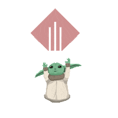

##                     
<html>🌌 Mandalorian Social Media Network API 🌌</html>

# Table of Contents
- [Description](#description)
- [User Story](#user-story)
- [Acceptance-Criteria](#acceptance-criteria)
- [Installation](#installation)
- [Demo](#demo)
- [Repo](#repo)
- [Contact](#contact)
- [Contributing-to-This-Repo](#contributing-to-this-repo)
- [Badges](#badges)

# Description
This Morally Engaged Social Media Network API uses **_MongoDB_** database. This allows mass amounts of data that is unstructured to be manageable for a website. I am using [Mongoose](https://www.npmjs.com/package/mongoose) which supports promises and callbacks as well as [Express](https://www.npmjs.com/package/express)   

# User Story
AS A social media startup
I WANT an API for my social network that uses a NoSQL database
SO THAT my website can handle large amounts of unstructured data

# Acceptance Criteria 
GIVEN a social network API
WHEN I enter the command to invoke the application
THEN my server is started and the Mongoose models are synced to the MongoDB database
WHEN I open API GET routes in Insomnia for users and thoughts
THEN the data for each of these routes is displayed in a formatted JSON
WHEN I test API POST, PUT, and DELETE routes in Insomnia
THEN I am able to successfully create, update, and delete users and thoughts in my database
WHEN I test API POST and DELETE routes in Insomnia
THEN I am able to successfully create and delete reactions to thoughts and add and remove friends to a user’s friend list

# Installation:  
📖 This application runs using MongoDB. 
- You can clone the deployed repo [here](https://github.com/RogueStorm7/Morally-Engaged-Social-Media-Network-API.git)

- Run the following commands to get set everything up.
    -   npm init -y
    - npm install [express](https://www.npmjs.com/package/express)
    - npm install [mongoose](https://www.npmjs.com/package/mongoose)

- To start the server:
    - **npm start**

# Demo

# Repo
Check out my Github profile at [RogueStorm](https://github.com/RogueStorm7/Morally-Engaged-Social-Media-Network-API.git)

# Contact

[miantamcknight@220gmail.com](https://miantamcknight220@gmail.com)

# Contributing to This Repo: 
Not taking pull requests at this time.

## Credits

**Baby Yoda GIF's** were obtained from [giphy.com](https://giphy.com/stickers/star-wars-yoda-aquellanerd-kfWSNKWMPM03LnwqXo)
## Badges 

 

 

&copy; 2022 Mianta McKnight  | All rights reserved | 
